# 📚 Timedoor Backend Programming Exam – Laravel Bookstore Project

## 📖 About This Project

This is a Laravel-based bookstore management system created for the **Timedoor Backend Programming Exam**.
The system allows listing books with filtering options, showing the top 10 authors based on ratings, and submitting ratings for books.

Data is **auto-generated** using Laravel seeders, so once you set up the project, you will immediately have:

* **1,000** fake authors
* **3,000** fake book categories
* **100,000** fake books
* **500,000** fake ratings

---

## 🚀 Features Overview

### **1. Book List with Filters**

* Displays the **top 10 books** with the highest average ratings by default.
* Search books by **title** or **author name**.
* Filter the number of results displayed per page (**10 to 100**, increment of 10).
* Shows **average rating** and **total votes** for each book.

### **2. Top 10 Most Famous Authors**

* Authors ranked based on the **total number of votes** for their books.
* Only counts votes from ratings **greater than 5**.
* Displays author name and total votes.

### **3. Input Rating**

* Allows selecting a book (filtered by its author).
* Rating scale from **1 to 10**.
* After successful submission, user is redirected back to the **Book List** page.

---

## 🔄 System Flow Diagram

```mermaid
flowchart TD
    A[📖 Book List Page] -->|Click 'Top Authors'| B[👨‍💼 Top Authors Page]
    A -->|Click 'Rate a Book'| C[⭐ Input Rating Page]
    C -->|Submit Rating| A
    B -->|Back to Book List| A
```



---

## ⚙️ Requirements

* **PHP** ≥ 8.1
* **Laravel** ≥ 10.x
* **MySQL / MariaDB** (no other DB supported)
* Composer
* Node.js & NPM (optional if you want to compile assets, but not required for this test)

---

## 📦 Installation Steps

1. **Clone the repository**

   ```bash
   git clone https://github.com/geraldhd/timedoor-book-case.git
   cd timedoor-book-case
   ```

2. **Install PHP dependencies**

   ```bash
   composer install
   ```

3. **Copy `.env` file and set database credentials**

   ```bash
   cp .env.example .env
   ```

   Update your `.env`:

   ```
   DB_CONNECTION=mysql
   DB_HOST=127.0.0.1
   DB_PORT=3306
   DB_DATABASE=your_database_name
   DB_USERNAME=your_database_user
   DB_PASSWORD=your_database_password
   ```

4. **Run migrations and seed the database**
   *(This will automatically generate all fake data for testing)*

   ```bash
   php artisan migrate --seed
   ```

5. **Start the development server**

   ```bash
   php artisan serve
   ```

6. **Access the app**
   Open [http://localhost:8000](http://localhost:8000) in your browser.

---

## 📝 Important Notes for Timedoor Test

* **Preloaded Data:** When the application first opens in the list view, it will already display the data provided via Laravel seeders. No manual data input is required.
* **No Caching:** The project does **not** use any form of caching (Laravel cache, Redis, query caching, etc.) to ensure all queries run directly from the database for evaluation purposes.
* **Database:** This project uses **MySQL** as the only supported database engine.
* **No SQL Dump:** There is **no** `.sql` or MySQL dump file included. All data is generated dynamically using Laravel's seeder system via `php artisan migrate --seed`.
